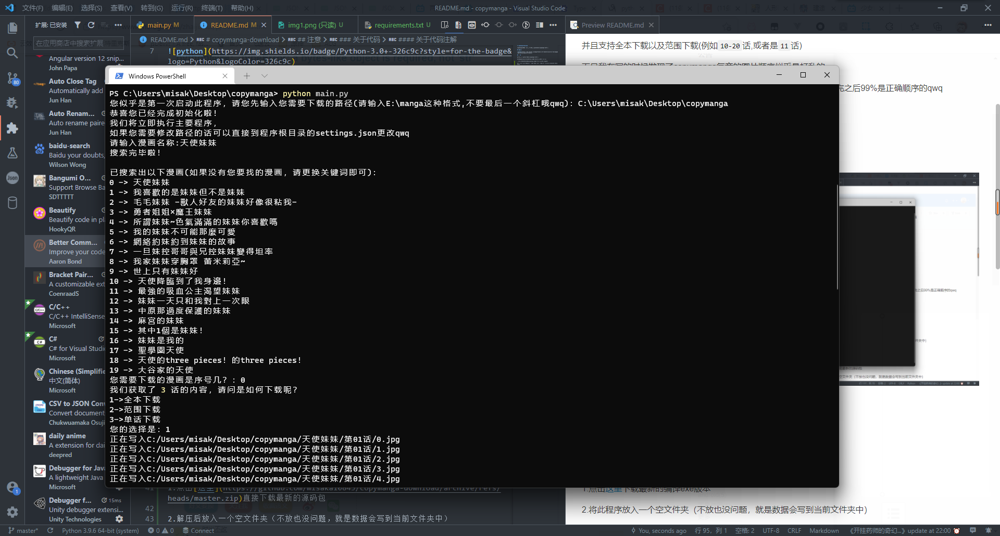

# copymanga-download

copymanga网站的一个小爬虫，来使用python下载copymanga中的漫画

## 注意！

**如果您的issue已经过了几天还没有被我受理，还请您发送邮件到misaka10843@outlook.jp来通知我，十分感谢！**

### 代理问题

clash等一些全局代理可能会导致urllib出现问题（具体可以看[copymanga-download #8](https://github.com/misaka10843/copymanga-download/issues/8) )

解决方法：[clash_for_windows_pkg #1787](https://github.com/Fndroid/clash_for_windows_pkg/issues/1787)

## 技术栈


## 简介

此程序使用`python`来下载copymanga中的漫画

并且支持全本下载以及范围下载(例如`10-20`话,或者是`11`话)

而且我在写的时候发现了copymanga每章的图片顺序似乎是打乱的，

但是也有个`word`数组对应着每张图片的顺序，所以就小改一下，下载完之后99%是正确顺序的qwq

（如果不是那就重新下载一遍，如果还有的话就发**issuse**吧qwq）

如果您是安卓用户，那么您可以使用[fumiama](https://github.com/fumiama/)的[copymanga](https://github.com/fumiama/copymanga)客户端尝试下载

## 更新

### 重大更新：
2022/3/24：暂时支持设置代理(但是大概率无法下载，请注意，如果出现问题请在提交相关信息

2022/2/25：修复copymanga的url问题（copymanga.com似乎已经被弃用，已更换到copymanga.net）

2022/2/13：Github自动编译Windows EXE文件！[actions](https://github.com/misaka10843/copymanga-download/actions/workflows/python-app-Windows.yml)

2022/1/14：Github自动编译Linux(应该)二进制文件！[actions](https://github.com/misaka10843/copymanga-download/actions/workflows/python-app.yml)

2021/11/18：增加获取用户收藏的漫画并且支持下载


## 放几张截图qwq（时效性不敢保证）

这张是第一次初始化之后的qwq


这张是第一次初始化的qwq



## 如何使用

### 立即使用(Windows)

1.点击[这里](https://github.com/misaka10843/copymanga-download/releases/latest)下载最新的从作者电脑中编译的exe版本，或者下载GitHub中的编译文件[actions](https://github.com/misaka10843/copymanga-download/actions/workflows/python-app-Windows.yml)(稳定无法保证)

2.将此程序放入一个空文件夹（不放也没问题，就是数据会写到当前文件夹中）

3.直接双击exe即可qwq

### 立即使用(Linux,无法保证能否运行)

1.点击[actions](https://github.com/misaka10843/copymanga-download/actions)选择最新的编译(100%同步更新，但不能保障是否能运行)

2.下载`附件`中的`copymanga-download-Linux`压缩包

3.解压`copymanga-download-Linux`压缩包

4.将此程序放入一个空文件夹（不放也没问题，就是数据会写到当前文件夹中）

5.运行即可qwq

### 编译/原代码使用(所有系统均支持)

1.点击[这里](https://github.com/misaka10843/copymanga-download/archive/refs/heads/master.zip)直接下载最新的源码包

2.解压后放入一个空文件夹（不放也没问题，就是数据会写到当前文件夹中）

3.先运行这个来安装依赖`pip install requirements.txt`(其实也就只有个`requests`需要安装，其他都是python自带的(￣▽￣))

4.然后运行`python main.py`即可

### 如何获取authorization(此为获取用户收藏漫画)
1.访问https://copymanga.net/web/person/shujia

2.按下F12后刷新页面

3.找到类似`comics?limit=12&offset=0&free_type=1&ordering=-datetime_modifier`的文件(?)后点击

4.在**请求标头**中找到`authorization: Token {各有各的不同}`，复制`Token {各有各的不同}`即可，如`Token 1293asd123s8adhh2juhsada2`

图片（[大图查看](https://i.loli.net/2021/11/18/Tv85D4a7GO9jNbn.png)）：


## 注意

### 关于api

此程序所使用的所有资料获取的API均为官方API
具体使用如下

```text
漫画搜索：
https://api.copymanga.net/api/v3/search/comic?format=json&limit=18&offset=0&platform=3&q={关键词}

漫画章节获取：
https://api.copymanga.net/api/v3/comic/{漫画path_word}/group/default/chapters?limit=500&offset=0&platform=3

漫画每章图片获取：
https://api.copymanga.net/api/v3/comic/{漫画path_word}/chapter2/{章节UUID}?platform=3

用户收藏漫画获取（需要设置headers['authorization']）:
https://copymanga.net/api/v3/member/collect/comics?limit=50&offset=0&free_type=1&ordering=-datetime_modifier
```

### 关于代码

#### 关于manga_download的def

因为一下int not str,

一下srt not int 所以就一修运行一次，

然后修的有点乱，

可能以后会重新写一下吧qwq

#### 关于有时候下载会卡住

这应该是copymanga的服务器限制

绝对不是我的问题＞︿＜

如果遇见这种情况的话请`Ctrl+C`终止程序后使用`范围下载`或者`单话下载`

(其实单话下载与范围下载使用的代码是一样的，只不过就是直接将范围下载的两个参数合并成一个而已qwq)

或者可能是已经下完了，但是还没结束循环qwq

#### 关于代码注解

因为代码注解时使用了VScode的`Better Comments`插件来使注解有对应颜色来让开发者更加明了地分析代码，

所以建议您也安装此插件来获取更好的代码理解


## Thanks

* [Z-fly](https://github.com/Z-fly)(贡献与提出代理问题)

* [zhongfly](https://github.com/zhongfly)(提供代理问题解决方法)

---

更多资料还在编写中....
